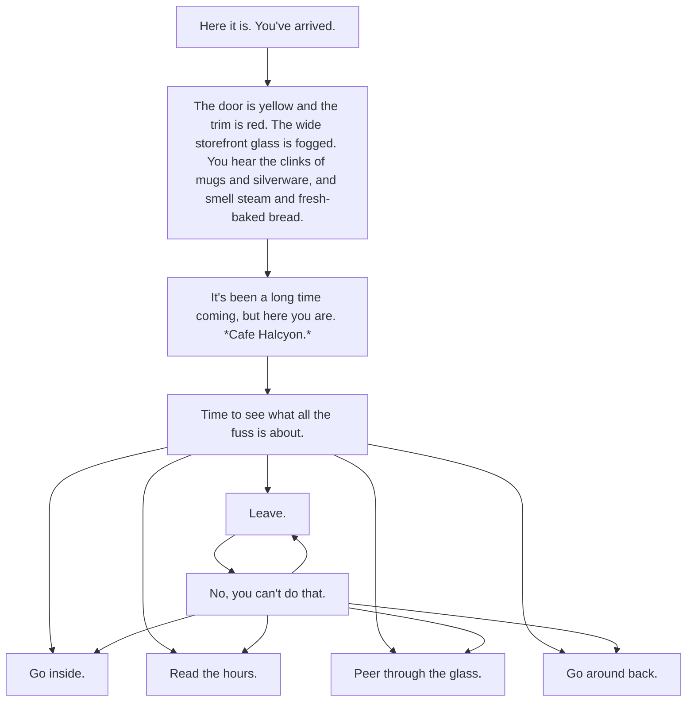
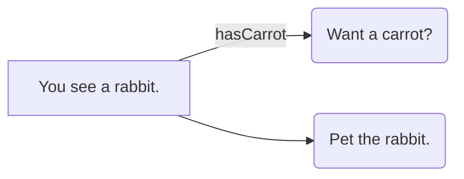
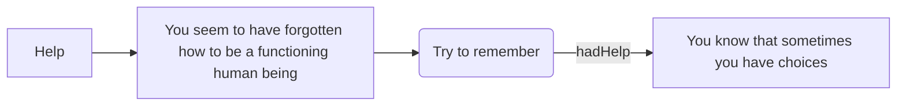

so what are the things I want to support

1. simple creation/linking
2. greying out or hiding choices that have already been made
3. variables based on choices

so maybe there are two types of choices/etc -> linear and hub-based

a linear one might start and go through a series of branches, but ultimately you won't go back

a hub one will start in a location and give you a number of things to do/say

so a distinction between things that progress and things that just explore?

guess I have to work through some examples right

so maybe I need several different 'layouts' or types of cards
a hub kind, a linear kind, one where the choices are just 1.2.3., one where they're taken from metadata, etc

and then how do I handle variables?
I need to store what decisions have been made, that's the only agency the player has correct? Should there also be a bit to put in your name/pronouns?

wait ok ok

so it should be more of a list of things that happen, or are triggered, with choices

linear and hub-based

so [] square brackets are information
and () parentheses are exploration choices
and {} curly brackets are navigation/irreversible choices